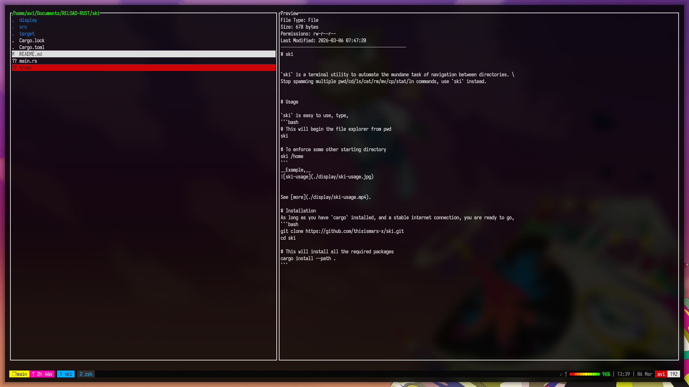

# ski


`ski` is a terminal utility to automate the mundane task of navigation between directories. \
Stop spamming multiple pwd/cd/ls/cat/rm/mv/cp/stat commands, use `ski` instead.


# Usage

`ski` is easy to use, type,
```bash
# This will begin the file explorer from pwd
ski

# To enforce some other starting directory
ski /home
```
__Example,__



See [more](./display/ski-usage.mp4).

# Installation
As long as you have `cargo` installed, and a stable internet connection, you are ready to go,
```bash
git clone https://github.com/thisismars-x/ski.git
cd ski

# This will install all the required packages
cargo install --path .
```
